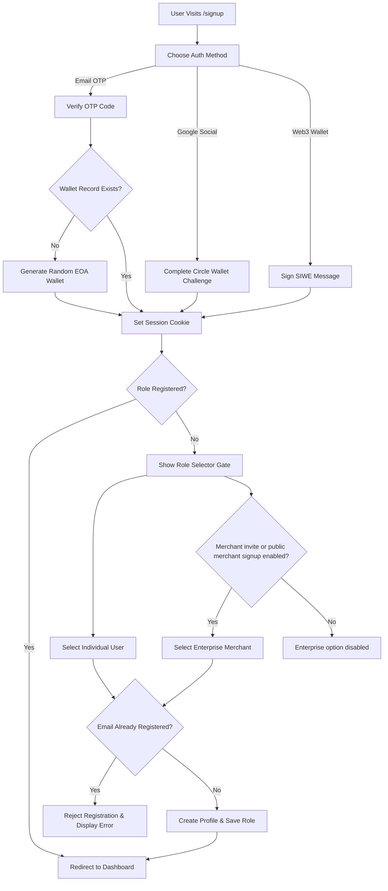

# Onboarding Process & Authentication Guide

This document describes the complete onboarding, registration, and identity verification process for the SubScript payment protocol. It details the user flows, authentication providers, role selector gates, and security rules implemented to ensure absolute data consistency.

---

## 1. Onboarding Methods

SubScript supports three discrete authentication and wallet provisioning channels:

### A. Email OTP Wallet
* **Target Audience**: Non-Web3 native payers who prefer managed account recovery.
* **Process**:
  1. User inputs their email address on the signup screen.
  2. The system checks if the email is already in use via `/api/auth/check-account`. If it exists, they are routed to the sign-in flow.
  3. A 6-digit numeric OTP is sent to the user's email address using the Resend email service.
  4. Upon entering the correct OTP, the system checks if a wallet record already exists in `user_embedded_wallets`.
  5. If no wallet exists, the backend securely derives a new, random Ethereum EOA wallet via `ethers.Wallet.createRandom()`, encrypts the private key, and stores it in the database.
  6. The session cookie is established, and the user is redirected to the role selector.

### B. Google Social Wallet (Circle EOA)
* **Target Audience**: Users seeking seamless web2-to-web3 social login.
* **Process**:
  1. User clicks the "Google Social Sign In" button, which opens the Circle OAuth login popup.
  2. Upon successful authentication, the Google OAuth subject and email are retrieved.
  3. A deterministic, non-custodial Circle EOA wallet is retrieved/initialized for that specific social UUID.
  4. The system validates that this email is not associated with any other wallet address in `user_embedded_wallets`.
  5. If the mapping is valid, a session cookie is issued, and the user proceeds to the role selector.

### C. Web3 Wallet (SIWE)
* **Target Audience**: Web3 native users, merchants, and operations administrators.
* **Process**:
  1. User connects their Web3 browser extension (MetaMask, Rabby, etc.) via Wagmi connectors.
  2. The frontend requests a cryptographic session nonce from `/api/auth/nonce`.
  3. The user signs a standardized SIWE (Sign-In with Ethereum) message using their private key.
  4. The backend verifies the signature using Viem's `verifyMessage`.
  5. A session cookie is established. If this is a new wallet, the user is prompted to link an email address during the role registration phase.

---

## 2. Onboarding Lifecycle

---

## 3. Strict Security & Role Isolation Gates

To prevent role confusion, account hijack, and double email mapping, the onboarding system enforces several active security guards:

### A. Role Gating & Separation
* **Individual User (`USER`)**:
  - Automatically routes to `/dashboard/user`.
  - Allowed features: Allowances management, subscription tracking, and peer requests.
  - Strictly blocked from accessing merchant payout controls, API keys, or webhooks.
* **Enterprise Merchant (`ENTERPRISE`)**:
  - Automatically routes to `/dashboard` (control center).
  - Allowed features: Billing tier setup, payroll campaigns, settlement triggers, and developer webhooks.
  - Strictly blocked from accessing user-facing dashboard functions.
  - Public signup is invite-gated by default. New merchant creation requires either `ALLOW_PUBLIC_MERCHANT_SIGNUP=true` or a matching `MERCHANT_SIGNUP_CODE` supplied through a merchant invite link such as `/signup?role=merchant&invite=<code>`.

Normal `/signup` is user-first and does not expose public merchant account creation. Existing Enterprise accounts remain valid and continue routing to the merchant dashboard.

### B. Email Uniqueness Enforcement (Anti-Double-Mapping)
An email address can only be mapped to exactly one wallet address. This rule is enforced across all API endpoints:
1. **Check Account Gate**:
   - `/api/auth/check-account` queries the `user_embedded_wallets` table. If the email address is present, it returns `exists: true` regardless of whether they have finished selecting their account role. This forces returning users to sign in and authenticates them into their existing wallet address instead of generating duplicate accounts.
2. **Social Completion Gate**:
   - `/api/auth/circle/wallet/complete` checks if the social email is already registered to a different wallet address. If so, it halts setup and returns a `409 Conflict` error.
3. **Role Registration Gate**:
   - `/api/auth/register-role` runs a union query checking if the linked email address is already present in either `user_embedded_wallets` or `customers` associated with any other wallet address. If a conflict exists, it aborts the database transaction and returns an error: `"This email is already associated with another account."`

### C. MetaMask Session Drift Detection
- If a user changes their active connected wallet address inside MetaMask mid-session, client-side guards detect the address drift, trigger `/api/auth/logout` to terminate the backend session, and redirect the user back to `/signup`.
