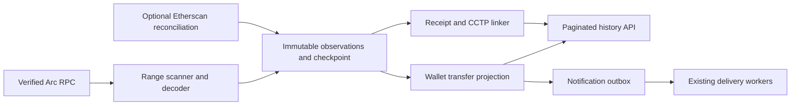

# Arc onchain tracker: implementation plan

Prepared 2026-10-04. Status: planning; no tracker, deployment, provider purchase, or database migration has been executed by this work.

## Scope and decision

Build a durable, RPC-first tracker for SubScript wallet deposits and outgoing transactions on Arc. Initial draft scope includes CCTP linking for supported routes into/out of Arc. The coverage question is optional and remains open; this is the recommended default, not a recorded user selection. Index other chains only as needed to verify the two legs of those routes. Arbitrary tokens, NFTs, new bridging routes and automated spending are outside this first version.

Use the existing `ethers`, `viem`, `pg`, Prisma and outbox infrastructure; add no dependencies by default. Keep dashboard APIs as database reads. Ingestion must continue while every browser is closed.

The main drivers are complete history, reliable restart/replay, correct multi-event accounting, environment isolation and reduced request latency. The current implementation combines explorer scans, receipts, DMs and bridge state rather than maintaining a durable chain cursor. Evidence: `src/lib/deposits/arcDeposits.ts:52`, `src/app/api/user/deposits/route.ts:19`, `src/lib/kafka/consumer.ts:60`, `prisma/schema.prisma:638`.

| Option | Advantages | Costs / limitations | Decision |
|---|---|---|---|
| Continue Etherscan as primary; move scans to a worker and buy Lite+ | Smallest provider change; useful indexed historical reconciliation | Paid Arc community endpoints from October 16; still needs pagination, durable cursors, event identities and receipt verification | Useful temporary continuity option, not the preferred permanent ingestion source |
| RPC-first durable worker; optional Etherscan reconciliation | Direct event identity; predictable ingestion independent of dashboard reads; no reliance on a free explorer entitlement | Requires an operated worker, tested RPC range/retention limits, backfill and health monitoring | Recommended |
| Operate a full/archive Arc node | Highest infrastructure control and historical availability | Additional hosting, storage, upgrades and operational work; not required for this platform's first tracker | Defer unless retained RPC history/cost makes it necessary |

RPC-first does not mean free infrastructure. Select an RPC with sufficient historical logs, rate limits and failover; verify these capabilities before committing to a provider or deployment runtime. Existing code has conflicting provider defaults (`src/lib/vault/onchain.ts:50`, `src/app/api/receipts/index/route.ts:27`, `src/lib/kafka/consumer.ts:26`).

## Verified provider rules

- Arc Mainnet is `5042`. Etherscan community endpoints are free through October 15, 2026 and require Lite or higher from October 16. Source-code and ABI endpoints remain on the Free tier. [Official supported-chains notice](https://docs.etherscan.io/supported-chains).
- Lite currently permits 5 requests/second and 100,000/day, without PRO endpoints. These are limits to design around, not an assurance that the configured account has entitlement. [Official rate limits](https://docs.etherscan.io/rate-limits).
- Treat the user's exact attribution requirement as a release gate: **Powered by Etherscan.io APIs**, linked to Etherscan wherever explorer-derived data is displayed. The public help page asks for attribution rather than establishing a universal mandatory contract; the user's requirement still applies. [Official attribution guidance](https://etherscan.io/help/etherscan/developer/i-need-an-api-key).
- Arc's native system Transfer emitter uses 18 decimals and covers explicit native/ERC-20 movements, including mint/burn; the ERC-20 USDC interface emits 6-decimal logs as well. Choose system logs as the canonical Arc USDC movement stream and retain ERC-20 logs as correlated evidence. Gas deductions require receipt-based calculation. [USDC system event reference](https://docs.arc.io/arc/references/usdc-system-events).
- Historical TEST coverage crosses a protocol upgrade: pre-Zero5 native events came from `0x1800000000000000000000000000000000000000` as `NativeCoinTransferred`, `NativeCoinMinted` and `NativeCoinBurned`. Pin the activation block from the official node changelog before backfill, version the decoder by environment/block interval and test both sides. Mainnet has used system Transfer events since genesis. If the old decoder or archive range is unavailable, expose that TEST coverage boundary and keep history incomplete. [Historical event matrix](https://docs.arc.io/arc/references/usdc-system-events#historical-events-before-zero5).
- Arc has deterministic finality. Use block/log ordering and gap detection, not Ethereum-style confirmation delays. Validate RPC identity and fail closed on provider disagreement; external CCTP chains retain their own finality/reorg policy. [Finality](https://docs.arc.io/arc/concepts/deterministic-finality), [indexing guidance](https://docs.arc.io/integrate/infrastructure/indexing-events), [RPC endpoints](https://docs.arc.io/arc/references/rpc-endpoints).

## Incident and code-flaw triage

“Fixed in source” does not prove the deployed app contains the fix. Sentry issue IDs, occurrence timestamps, release IDs, deployed environment and Upstash request traces were not supplied; no live Sentry connector is exposed in this session.

| Item | Current evidence | Required follow-up |
|---|---|---|
| Landing-page merge conflict | No conflict markers and zero TypeScript parse errors in current `src/app/page.tsx`; reported line 523 is valid content | Check deployed build/release for the original incident; retain merge-marker scan in CI |
| DB connection termination on fee estimate | Pool lacks idle-error handling, explicit broken-client eviction and bounded read recovery (`src/lib/serverPg.ts:13`, `:26`). Authentication catches DB failure and returns null (`src/lib/auth.ts:233`); fee route calls it at `src/app/api/user/wallet/estimate-fee/route.ts:11` | Distinguish infrastructure failure from invalid authentication; surface retryable 503; observe connect/queue/query durations. Retry only known-safe reads, never blindly replay financial writes |
| Sessions / banned accounts | Token index exists; banned lookup applies `lower` to a plain indexed address (`src/lib/auth.ts:189`, `supabase/migrations/20260810120000_admin_console_foundations.sql:60`) | Verify stored normalization and representative EXPLAIN before changing equality or considering an expression index |
| Unread notifications | Recipient and unread partial indexes exist. GET can materialize broadcasts and repeat queries (`src/app/api/notifications/route.ts:50`, `:79`, `:90`). Bell polls every 15s (`src/components/dashboard/NotificationBell.tsx:140`) | Bound broadcast work; add visibility/in-flight polling controls and measure before/after under representative load |
| Upstash failures / middleware P95 | Sequential maintenance, ban and limiter calls; analytics enabled on five limiters (`src/proxy.ts:151`, `:487`, `:679`, `:716`) | Separate transport errors, provider limits, analytics writes and expected policy denials. Do not weaken ban/abuse enforcement to hide errors |
| DMs P95 | Up to 500 messages plus sequential profile/role lookups (`src/app/api/user/dms/route.ts:64`, `:85`, `:146`) | Capture traces; cursor pagination and batched/parallel independent lookups; choose indexes from EXPLAIN, not the old report alone |
| Router before initialization | Role-router currently navigates through a guarded effect and `window.location.href` (`src/app/dashboard-router/page.tsx:12`) | Reproduce the original Sentry stack and verify its actual component; do not claim every router path is fixed |
| DNS timeout webhook retries | Source marks DNS errors transient and maps to 503 (`src/lib/webhookUrls.ts:72`, `src/lib/webhooks.ts:210`); outbox retries 5xx (`src/lib/webhookOutbox.ts:16`) | Add executable timeout/retry regressions and verify deployed version |
| Webhook credential logging | Explicit URL logging uses origin, but raw errors/messages remain (`src/lib/webhooks.ts:216`, `:321`) | Redact nested transport errors, query credentials and stored error strings; test logs and DB error payloads |
| Blocking schema changes | Immediate validation/ordinary index builds remain in historical migrations; runner has a no-transaction marker (`supabase/migrations/20260812000000_account_notifications.sql:47`, `scripts/apply-migrations.mjs:342`) | Use new forward migrations; separate NOT VALID add from later validation; concurrent indexes outside transactions with retry/invalid-index recovery. Preserve applied migration checksums |
| Environment/chain mixing | Arbitrary vault chain override (`src/lib/contracts/constants.ts:70`), testnet provider fallback with static network (`src/lib/vault/onchain.ts:50`), wallet-only vault configuration reads (`src/app/api/user/vault/config/route.ts:22`, `:79`) | Assert deployment identity, environment/chain/contract registry and actual `eth_chainId`; scope reads and jobs to it |

### Read-only Mainnet observations

Connected project `jntqgoneegykgtiyvvge` is named SubScript Mainnet; local `.env` / `.env.local` reference it. Several saved deployment env snapshots reference the older Waitlist project. This does **not** identify what the currently deployed release uses; resolve that before any rollout.

Metadata queried on 2026-10-04 confirms session token/wallet indexes, the banned-address primary key, notification recipient ordering and unread partial indexes. Approximate table populations are 42 sessions, 0 banned accounts and 26 notifications; sequential scans on small tables are not automatically a defect.

| Query group | Calls | Weighted mean execution | Maximum execution |
|---|---:|---:|---:|
| Banned-account query group, including matching session joins | 50,937 | 0.109 ms | 34.593 ms |
| Notifications | 54,569 | 0.048 ms | 13.019 ms |
| Remaining session queries | 435 | 1.222 ms | 16.332 ms |

These are cumulative `pg_stat_statements` execution statistics since its 2026-09-16 reset; grouping gives banned-account matches precedence over sessions. They are neither endpoint P95 nor connection-pool/network timings. Recent Supabase logs include 44 Supavisor error-level entries; their causes and relationship to the fee-estimate incident are unverified. No records, indexes or settings were changed.

The deployed, validated `metered_vaults_environment_chain_check` permits TEST `5042002` and LIVE `5042` **or `5042001`**. The canonical migration permits only legacy LIVE `5042001` (`supabase/migrations/20260717030000_api_key_mode_isolation.sql:55`), while cutover SQL permits both (`docs/mainnet/mainnet-sql-cutover.sql:99`). The table was empty in this read-only snapshot, but inventory every affected chain-bearing table before retiring legacy IDs. `cctp_bridge_transfers` has source/destination chain/domain columns and no environment column, matching its source migration.

## Architecture and invariants

### Observations and movement identity

Proposed new modules under `src/lib/tracker/` and a worker entry point under `scripts/`; names are proposed, not existing files. Store raw observations separately from receipts and merchant revenue. Existing `Receipt.txHash` is globally unique and `LedgerEntry` lacks chain/event identity (`prisma/schema.prisma:638`, `:415`); neither is suitable as the raw event store.

Raw observation identity: `(environment, chain_id, tx_hash, log_index, emitter)`, with block number/hash, transaction index, raw amount, emitter decimals, from/to, provider, decoder version and ingestion time. Normalize Arc amounts into integer micros for the compatibility API while preserving raw precision; never route financial arithmetic through floating-point numbers. Keep block timestamp separate from ingestion time. Order by block/transaction/log index; do not invent Date.now() timestamps as the current fallback does (`src/lib/deposits/arcDeposits.ts:310`).

The canonical Arc USDC movement is one system-emitter event. Correlated ERC-20/explorer rows enrich it and cannot create a second credited movement. Two equal transfers to the same recipient in one transaction are two movements, with distinct log indices. Tx-hash-only dedup is prohibited (`src/lib/deposits/arcDeposits.ts:145`, `:302`, `src/lib/transactions/history.ts:17`). Explorers that omit event indices require receipt/log verification before their observations become monetary projections; ambiguous correlation becomes a discrepancy, not a guessed credit.

Separate submitted operations from confirmed movements. Reuse the existing AA receipt decoders (`src/lib/vault/onchain.ts:65`, `src/lib/custody/index.ts:319`): outer transaction success does not prove a particular UserOperation succeeded. Gas fees are receipt-derived; recovered network-fee transfers remain distinct from user principal. A self-transfer, gas expense, mint, burn and external deposit must not all become “new money received.”

### Durable ingestion and recovery

Checkpoint identity includes environment, chain, stream/shard and decoder version. Store next block, last verified block hash, lease owner/expiry, fencing generation, coverage start and backfill status. A short DB transaction upserts observations and advances a fenced checkpoint **only after every required query for that range succeeds**. Perform RPC calls outside DB transactions. A timeout/partial RPC response does not mean an empty range and must not advance coverage.

In that same ingestion transaction, enqueue durable projection work. Separate raw coverage from projected-through coverage: advancing a scanner cursor never implies projection succeeded. Projection jobs have a unique observation/version/scope identity, pending/leased/done/dead state, expiry, attempts and a fencing token. Claim with short `FOR UPDATE SKIP LOCKED` transactions; atomically commit movement/view upserts, notification outbox intents and job completion. A crash after raw checkpoint but before projection therefore leaves discoverable pending work; dead jobs prevent a “fully projected” claim and raise an alarm. Replay/version upgrades re-enqueue work, not blindly reset money. Wallet registration/backfill must also enqueue wallet-view work for previously stored observations; an already-done generic projection cannot prevent the new wallet's history from being materialized.

Poll head over HTTP approximately every 2 seconds as the initial configurable target; WebSocket notifications may accelerate polling but are not the durable source of truth. Fetch bounded adaptive ranges, split range-limit errors, use limited concurrency, jittered retries and a provider circuit breaker. Reject wrong `eth_chainId` before scanning. Record actual processed block identity; Arc hash disagreement is a provider-integrity alarm, not an ordinary expected reorg. External-chain scanners must handle their own finality/reorg semantics.

A new worker must run independently of Next request lifetimes. Prefer a supervised Node process using current dependencies; a bounded keeper can drain ranges where that is the existing available runtime. A once-per-minute scheduler cannot satisfy a 10-second live-ingestion target. Runtime and budget remain an implementation deployment decision; demonstrate a 24-hour operated worker before cutover. Current `vercel.json` has no tracker scheduler, and legacy `EventSourcedEngine` has no found startup callsite, only an in-memory cursor (`src/lib/kafka/consumer.ts:60`).

### Wallet discovery, backfill and side effects

Build the watched-wallet registry from authenticated platform accounts and known deposit addresses; wallet registration creates a durable backfill request. For known account creation/deposit block anchors, scan from that anchor. For imported wallets without a provable earliest block, either backfill from chain genesis with an archive-capable RPC or return an explicit coverage-start/incomplete-history status until done. Never label a 50-row/5,000-block window as complete history (`src/lib/deposits/arcDeposits.ts:90`, `:234`). Catch up live ingestion and historical backfill with separate bounded queues so old imports cannot starve current transfers.

Project watched sender and recipient views with ownership-scoped queries. Notifications use a unique `(environment, chain_id, canonical_movement_id, recipient, channel)` outbox key created atomically with the projection. Historical backfill does not send fresh-deposit alerts. Replace body-prefix hash dedup (`src/app/api/user/deposits/route.ts:104`). Delivery is at least once with idempotent consumers; do not promise exactly-once email transport.

Before enabling a wallet cohort, persist a notification activation high-watermark `(environment, chain_id, wallet, block_number, transaction_index, log_index)` at a verified processed boundary, after disabling/draining the legacy producer. All observations at/before that boundary materialize history without live alerts, including previously delivered legacy GET deposits; old delivery is not reliably identifiable from body-prefix dedup. This intentionally suppresses pre-activation catch-up alerts, not history. Preserve the boundary and delivered outbox keys through restart, rollback and re-enable. A newly confirmed CCTP destination mint after its destination boundary can still alert even when its earlier burn predates activation. Rollback pauses new notifications and keeps legacy side-effect producers disabled; it must not silently restore legacy GET notification delivery. Re-enabling a legacy producer requires the same canonical delivery identities and boundary policy.

Indexing does not sweep funds, mint a bridge transfer or initiate a send. Existing deposits GET starts such work (`src/app/api/user/deposits/route.ts:19`); `/api/user/cctp/scan` also invokes `sweepAndBridge`, and its address parameter permits scanning without a successful session (`src/app/api/user/cctp/scan/route.ts:18`, `:26`). Dashboard and full-history callers are `src/app/dashboard/user/page.tsx:1179` and `src/app/dashboard/user/transactions/page.tsx:287`. Enumerate and replace both caller paths plus the server handler: retain any scan/status compatibility as authenticated, ownership-scoped reads; authorize spend/sweep work through stored intents and secret-protected existing dedicated keepers. Remove their dependency on dashboard visits only after equivalent scheduling/recovery is demonstrated.

### Receipt/CCTP reconciliation

Link CCTP legs by verified message identity, environment, source/destination chain/domain and event references. A burn is pending bridging, not a confirmed destination deposit; mint confirmation requires the destination event. Missing attestation/receipt means pending or unknown, not success. Keep unmatched zero-address mint provenance unknown instead of guessing CCTP (`src/lib/deposits/arcDeposits.ts:377`). Replace whole-hash bridge suppression with event-level linking (`src/app/api/user/deposits/route.ts:81`).

Require environment-scoped CCTP queries and a reviewed mapping of supported chains/domains before shared DB use (`src/lib/cctp/autoBridge.ts:100`, `src/lib/cctp/attestationWorker.ts:128`, `src/lib/cctp/relayer.ts:43`). A route requesting the opposite-environment Arc chain must fail, not resolve to whichever RPC the deployment currently uses.

### Read API and attribution

Keep `ArcDepositItem` compatibility through a DB-backed adapter (`src/lib/deposits/arcDeposits.ts:52`). Add cursor pagination, canonical movement ID, environment/chain, provenance, indexed-through block/time and coverage status. Distinguish empty history, stale/incomplete coverage and tracker outage; preserve last good history on failures. Remove network scanning and notifications from GET.

Carry provenance into the dashboard (`src/app/dashboard/user/page.tsx:1155`) and full history (`src/app/dashboard/user/transactions/page.tsx:286`). Display linked **Powered by Etherscan.io APIs** when their displayed dataset includes explorer-derived information, including cached/backfilled data. Check receipt/detail/export surfaces if they start exposing that data. RPC-only records need their own factual provenance; they do not justify an Etherscan claim. Keep explorer credentials server-only and retire the `NEXT_PUBLIC_ETHERSCAN_API_KEY` fallback (`src/lib/deposits/arcDeposits.ts:67`) after checking whether it has actually exposed a configured key.

## Implementation sequence and exit gates

| Phase | Concrete work and source seams | Exit gate |
|---|---|---|
| 0 — Baseline and continuity | Pin deployed release/env/database identity; capture Sentry/Upstash traces; measure pool/query timings. Inventory all explorer consumers; verify key entitlement before Oct 16. Fix attribution in existing explorer-backed views before rollout if they remain active | Evidence for each report is current or explicitly unverified; no dependent feature assumes free Arc access after cutoff |
| 1 — Isolation and safe failures | Forward migration for canonical environment-chain mapping; scope vault/CCTP reads; secure CCTP scan/address ownership; unify verified RPC construction in constants, relayer, receipt indexer and vault reader. Harden `serverPg`, auth outage semantics and webhook error redaction | Wrong chain/provider and live/test reads fail closed; arbitrary unauthenticated wallet scanning cannot start spending; disconnected safe reads yield 503 and recover; no write replay; DNS/redaction behavioral tests pass |
| 2 — Storage and fixtures | New observation/checkpoint/lease/projection-work/wallet-view tables plus outbox references. Default-deny RLS/no public raw-table access; grants only to worker/API roles. Additive migrations only | Fresh and upgrade schemas agree; migrations and realistic concurrent writers/readers pass; two equal same-hash transfers survive; raw checkpoint and work enqueue are atomic |
| 3 — Scanner and backfill | New scanner/decoder/worker; reuse canonical chain transport. Account registration queues durable coverage work, including already-observed events; historical TEST decoder honors activation boundary | Scanner and projector crash/restart tests show no gaps or duplicate projected movement; provider failure never advances checkpoint; unsupported historical epochs remain incomplete |
| 4 — Projection and links | Bind principal/fees/UserOperation outcomes and verified CCTP events; separate sweeps from observations and dispatch through existing keepers/outbox | Batch, inner revert, fee recovery and bridge lifecycle fixtures are correct; notifications idempotent and backfill quiet |
| 5 — Read API and UI | DB-backed deposits adapter; stable full-history event identity; cursor/provenance/freshness/attribution; remove deposits and CCTP scan side effects from both page callers | Dashboard/history load with provider unavailable; both GETs produce no chain or notification writes; complete/incomplete history labels are truthful |
| 6 — Shadow and cutover | Run tracker in shadow mode with notification delivery disabled; compare against known receipts and existing history, investigate discrepancies. Persist cohort activation watermarks, drain/disable legacy producer, then enable a small cohort | 24-hour shadow run; zero unexplained principal deltas, missing events or duplicate movements; previously delivered legacy deposits are not renotified; health/lag alarms and rollback rehearsed |

Do not rewrite old migrations or infer deployment from local files. Any concurrent index must run outside a transaction; add NOT VALID and validate in distinct operations so the initial lock is released. Test lock/statement timeouts and invalid-index retry handling through the actual migration runner. Receipt uniqueness changes are a separate reviewed compatibility decision, not a prerequisite for storing raw events.

## Acceptance criteria and validation

The executable scenarios and fixtures are specified in [tracker test specification](./arc-onchain-tracker-test-spec.md). Every phase must prove its exit gate; an existing source-pattern test does not prove a new scanner works.

1. Arc native and ERC-20 transfer fixtures produce exactly one canonical movement per system log and accurate raw/micros values; multiple same-hash equal transfers remain distinct.
2. New tracked accounts eventually receive provable historical coverage; imports without anchors expose incompleteness rather than silently truncate.
3. Stop/restart, lease expiry and concurrent workers cannot skip a range or double-project a movement; partial ranges never move the checkpoint. Projection work survives a committed raw checkpoint, and already-stored events can materialize a newly registered wallet view.
4. No TEST data/chain/contracts appear in LIVE APIs or jobs. Fresh migrations and the upgraded schema enforce the same supported mapping.
5. Failed AA operations do not create successful movement claims. Mint/burn, gas, recovery fees and user principal have distinct semantics.
6. CCTP linkage uses verified message/events; multiple actions in one hash remain visible; unmatched evidence stays unknown.
7. GET history reads the DB only; rate limits/provider outages leave last good history plus freshness, and never become misleading empty success.
8. Explorer-derived displays include the exact linked attribution; a plan/403/rate-limit error is a provider outage, not “no transactions.”
9. Backfill emits zero live alerts; activation watermarks suppress pre-cutover legacy alerts across rollback/re-enable; live retries use unique event/channel identities and redact secrets.
10. Proposed staging targets: P95 head-to-projection <=10s, DB-backed history P95 <=300ms at 20 concurrent readers across 1,000 watched wallets, after warmup and with pool wait included. These are design targets, not measured production claims. Choose larger load from actual adoption before cutover.
11. A 24-hour shadow comparison has no unexplained discrepancies; monitor lag, last successful range, provider error classes, lease contention, failed projections, pool wait and outbox age. Page on stalled coverage >60s or wrong-chain detection; alert separately for an imported wallet's expected backfill backlog.
12. Rollback disables new read cohorts and all new notification dispatch while keeping observations/checkpoints for diagnosis. Never blindly restore the old scanner after October 16 without verifying explorer entitlement and side-effect idempotency.

## Risks, release decisions and follow-up

| Risk | Mitigation / decision |
|---|---|
| Worker/RPC spend or runtime not chosen | Benchmark existing endpoints, pick supervised runtime and history retention, then provision within an agreed budget; no purchase made by this plan |
| Paid API cutoff arrives before tracker is ready | Verify Lite+ for interim explorer traffic, or expose RPC-backed limited coverage honestly until durable backfill is ready. Do not wait for a full rewrite to honor attribution |
| Existing chain drift reproduced by fresh deploy | Rehearse forward migrations on fresh and cloned schemas; inventory all legacy chain references; never merely change a CHECK around legacy rows |
| Network balance differs from event projections | Reconcile principal movements, mint/burn and receipt-derived gas separately; a balance delta is a discrepancy signal, not an invented deposit |
| Double delivery from old GET and new outbox | Shadow side effects disabled; persist activation watermarks and canonical delivery keys; old producers remain off even during rollback |
| Long backfill overloads DB or RPC | Separate live/backfill budgets, bounded batches and transactions, explicit coverage status and provider backpressure |

The first implementation work should be phase 0/1 and event-identity fixtures, followed by durable ingestion. Dashboard animation and optimistic rows remain presentation features, not evidence of onchain settlement.

Existing verification in this planning pass: landing-page syntax/marker inspection; 32 auth/isolation/webhook/durability source regressions passed; Mainnet read-only indexes, CHECKs, column metadata, approximate counts, cumulative query stats and aggregate log levels inspected. Those tests do not verify tracker functionality or prove the historical Sentry errors are resolved. Runtime trace capture, provider entitlement, worker operation and new behavioral tests remain explicit implementation gates.
